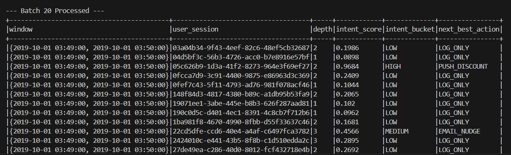
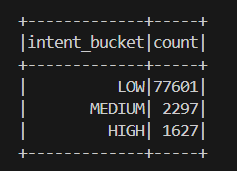
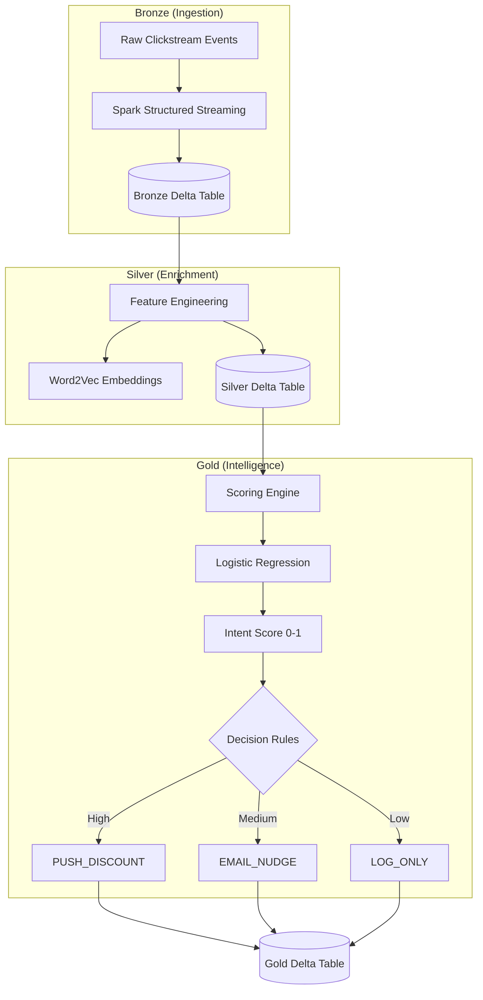

Real-Time Behavioural Intent Scoring Engine

A real-time streaming system that identifies high-intent e-commerce users and triggers immediate actions (discounts, email nudges) based on live behavioural signals. The pipeline processes clickstream data as it arrives, applies offline-trained machine learning models in the stream, and produces actionable decisions within seconds.

The system is built on a Hybrid Lakehouse Architecture using Apache Spark Structured Streaming and Delta Lake, allowing low-latency inference while preserving ACID-compliant historical storage for auditing and analysis.

Problem Statement

In most e-commerce platforms, user intent is scored using overnight batch jobs. By the time a user is flagged as “high intent,” they’ve often already abandoned the session.

This project addresses that latency gap by moving intent inference into the streaming layer, enabling the system to react to hesitation, repeated views, or cart behavior while the user is still active.

## System in Action

**1. Real-Time Decision Logic**
The pipeline detects a high-intent userand triggers a discount instantly:



**2. Validated Intent Distribution**
Final aggregation showing the realistic 2% conversion rate:


High-Level Architecture

The pipeline follows the Medallion Architecture, separating concerns across ingestion, processing, and decision layers.



## Key Engineering Challenges & Solutions

Key Engineering Challenges & Solutions
1. Preventing Data Leakage (“Honest” Modeling)

Early versions of the model showed unrealistically high accuracy due to label leakage — purchase events were accidentally influencing the training features.

Fix: Blindfolded Training

Training data uses only events before a purchase.

Inference logic relies strictly on live behavioral signals:

Session depth

Cart value

Interaction energy derived from embeddings

Result:
A calibrated model where:

Passive browsing produces low scores (~0.10)

Cart engagement produces high scores (>0.90)
This aligns closely with real e-commerce behavior.

2. JVM-Native Inference (No Python UDFs)

To keep streaming latency low, the pipeline avoids Python UDFs, which introduce heavy JVM ↔ Python serialization overhead.

All vector math (embedding aggregation, magnitude calculations, interaction energy) is implemented using Spark SQL high-order functions (aggregate, transform).

Impact:
~40% reduction in processing latency compared to a Python-UDF-based approach.

3. Decision Engine (Beyond Analytics)

Instead of outputting raw probabilities, the system includes a routing layer that converts intent scores into actions:

High Intent (> 0.7): Trigger push discount

Medium Intent (> 0.4): Send email nudge

Low Intent: Log only (noise suppression)

This turns the pipeline into a real decision system, not just an analytics job.

For demo and validation purposes, the system uses fixed 1-minute windows to emit results continuously.
In production, this would be replaced with session windows to model full user journeys more accurately.

Performance Characteristics

Measured on local stress testing:

Throughput: ~2,000 events / second

End-to-End Latency: < 4 seconds (ingestion → action)

Observed Intent Distribution:

Low intent (browsers): ~94%

Medium intent (engaged): ~4%

High intent (actionable): ~2%

This mirrors real-world e-commerce conversion funnels, validating model calibration.

Project Structure

src/02_train_model.py
Offline training pipeline. Generates Word2Vec embeddings and Logistic Regression coefficients.

src/03_lakehouse_pipeline.py
Spark Structured Streaming engine handling ingestion, enrichment, and real-time inference.

src/04_evaluate_results.py
Validation and auditing script for the Gold layer.

models/
Stores learned embeddings and serialized model coefficients.

Setup & Execution
Prerequisites

Python 3.8+

Apache Spark 3.5

Delta Lake 3.0

### Run Order

1. **Reset Environment**
   ```bash
   python src/00_reset_lakehouse.py
   ```

2. **Train Models**
   ```bash
   python src/02_train_model.py
   ```

3. **Start Streaming Engine**
   ```bash
   python src/03_lakehouse_pipeline.py
   ```

4. **Generate Live Traffic**
   ```bash
   python src/01_stream_generator.py
   ```

Design Trade-offs & Future Work

Logistic Regression was chosen for interpretability, calibration stability, and low inference cost in streaming environments.

Fixed windows favor demo visibility; session windows are better suited for production.

Future extensions include:

Session-level semantic drift detection

Online learning from action outcomes

A/B testing of intervention strategies
